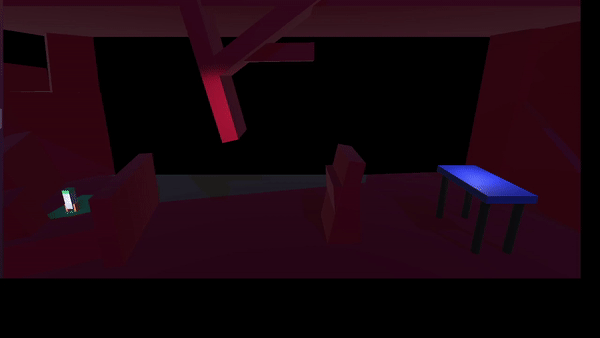
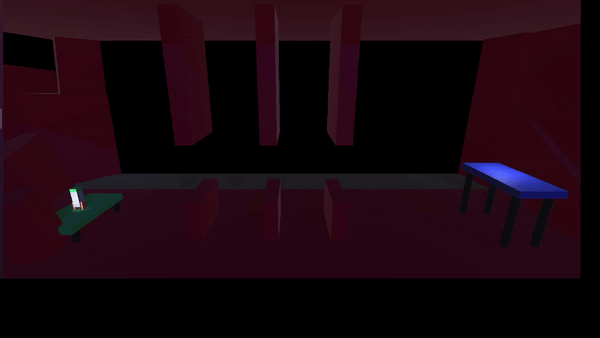

# Overview
This project was created following the guidance of the course [Complete C# Unity Game Developer 3D](https://www.udemy.com/course/unitycourse2/). We've created a basic obstacle avoidance game using Unity as a game engine. The player controls a rocket through a hazardous environment, trying to get to a landing pad on the other side of a level. Levels increase in difficulty and use subtle variations to keep the player interested. The visual aspects of the example game are pending some improvements, 

## Controls
- **A**: Turn Left
- **D**: Turn Right
- **Space**: Thrust Forward

## Behaviour
- The player uses a rocket equiped with a flashlight to explore a dimly lit cavern and tries to reach the other side.
- When crashing into hazardous objects the rocket explodes and the game is restarted.

- When the player reaches the landing pad, a success animation plays and the next level is loaded.

- Currently the game resets upon finishing the final level.